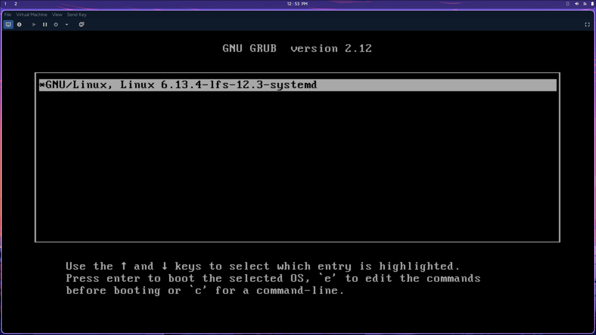
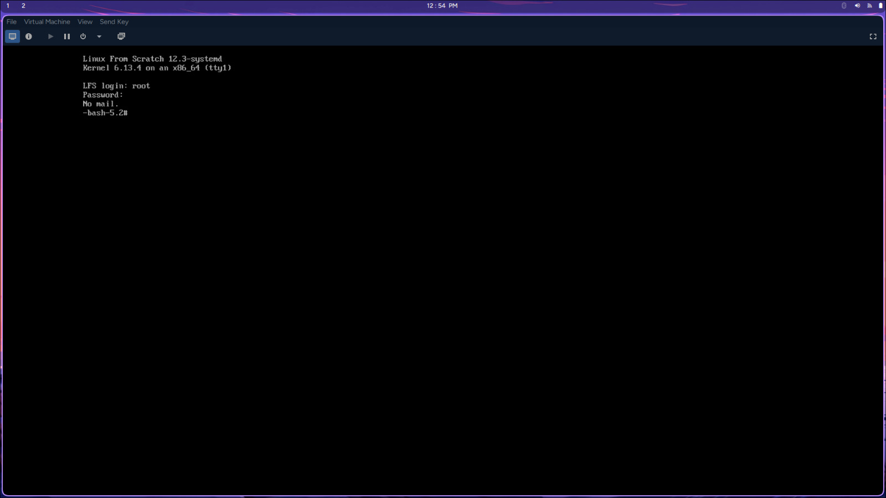
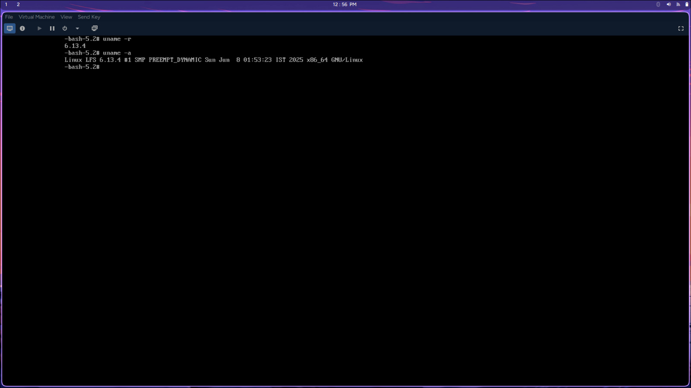

# 🧱 Linux From Scratch – Custom Linux Build


Welcome to my journey of building a fully functional Linux system from scratch based on the [Linux From Scratch 12.3 Systemd edition](https://www.linuxfromscratch.org/lfs/view/systemd/). This project demonstrates the process of creating a minimal, bootable Linux distribution entirely from source code.

---

## 📸 Project Screenshots

### GRUB Boot Menu


### Systemd Login


### Booted System (`uname`)


---

## 🧰 Host System Details

| Detail          | Value                                              |
| --------------- | -------------------------------------------------- |
| **Host OS**     | Arch Linux                                         |
| **VM OS**       | Linux Mint                                         |
| **VM Type**     | QEMU/KVM via Virt-Manager                          |
| **VM Specs**    | 8 GB RAM, 4 vCPU (2 cores, 2 threads), 100 GB Disk |
| **Build Mode**  | BIOS (Legacy Boot)                                 |
| **LFS Version** | 12.3 (systemd)                                     |
| **Kernel**      | Custom built with `virtio` and `e1000` drivers     |

---

## 🚀 Key Highlights

- ✅ Followed LFS 12.3 Systemd book with no variable changes
- 🔧 Built entirely inside a QEMU VM with Linux Mint as host
- 🐛 Resolved build issues (e.g., `xmalloc` error in Bash) by downgrading host GCC from 15 to 13
- 🔌 Recompiled kernel for working network drivers inside VM
- ⚙️ Configured GRUB bootloader and fixed rescue mode errors
- 🛠️ Used `systemctl preset-all` to auto-enable default services

---

## 📂 Project Structure

```bash
LFS-Project/
|-docs/
|	|- 01-intro.md
|	|- 02-host-setup.md
|	|- 03-temporary-tools.md
|	|- 04-final-system.md
|-screenshots/
	|- grub.png
	|- inital-login.jpeg
	|- uname.jpeg
|- Readme.md
```
